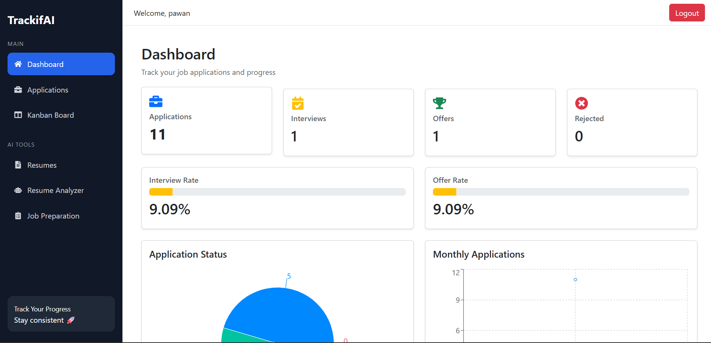
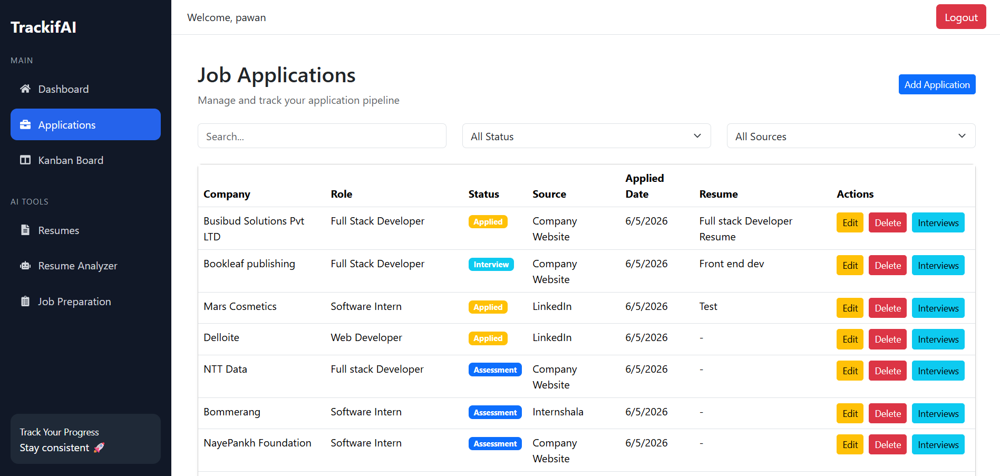
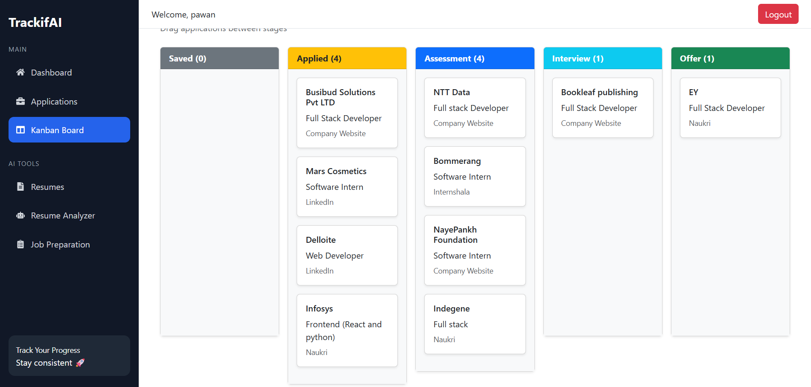
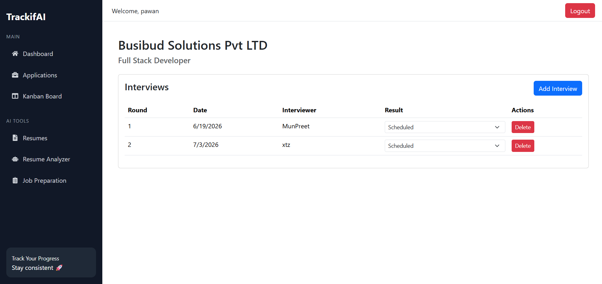
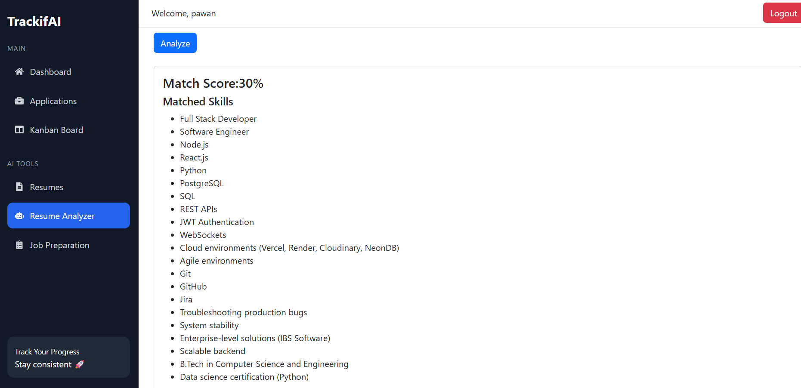
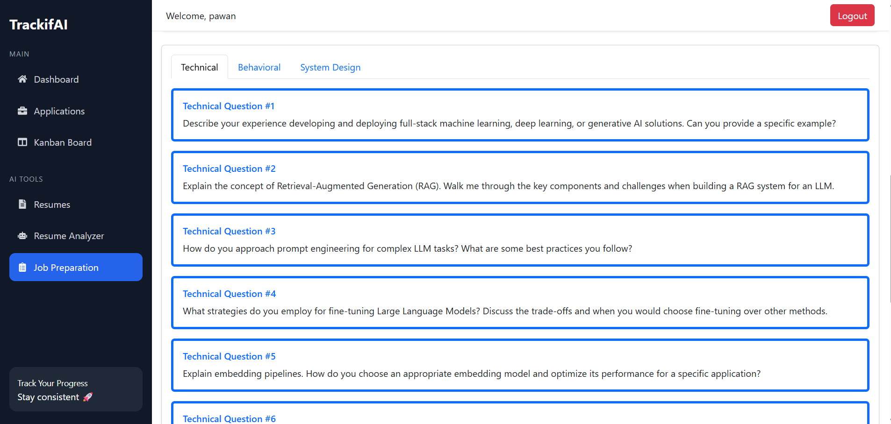
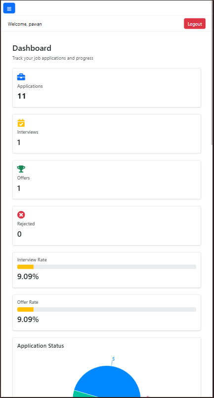

# 🚀 TrackifAI Frontend

TrackifAI is an AI-powered job application tracking platform that helps job seekers organize applications, monitor progress, prepare for interviews, and gain insights into their job search journey.

---

## 🚀 Live Demo

🌐 **Frontend:** https://trackif-ai-fe.vercel.app/login

⚙️ **Backend API:** https://trackifai-backend1.onrender.

---

## ✨ Features

- 🔐 User Authentication (Login / Register)
- 📋 Application Management
- 📊 Dashboard Analytics
- 📌 Kanban Board for Application Tracking
- 🎯 Interview Tracking
- 📄 Resume Management
- 🔍 Search & Filter Applications
- 📱 Responsive Design
- ⚡ Real-time Status Updates

---

## 🛠️ Tech Stack

- React.js
- React Router DOM
- Axios
- Bootstrap 5
- React Icons
- @hello-pangea/dnd (Drag & Drop)
- Vite

---

## Project Structure

```text
src/
│
├── api/
│   └── axios.js
│
├── components/
│   ├── ApplicationForm.jsx
│   ├── Navbar.jsx
│   └── ProtectedRoute.jsx
│
├── constants/
│   └── applicationStatus.js
│
├── layout/
│   └── DashboardLayout.jsx
│
├── pages/
│   ├── Dashboard.jsx
│   ├── Applications.jsx
│   ├── KanbanBoard.jsx
│   ├── Interviews.jsx
│   ├── Login.jsx
│   └── Register.jsx
│
├── styles/
│
└── App.jsx
```

---

## ⚙️ Installation

### Clone Repository

```bash
git clone https://github.com/yourusername/trackifai-frontend.git
```

### Navigate to Project

```bash
cd trackifai-frontend
```

### Install Dependencies

```bash
npm install
```

### Start Development Server

```bash
npm run dev
```

Application will run at:

```text
http://localhost:5173
```

---

## Environment Variables

Create a `.env` file in the root directory:

```env
VITE_API_URL=http://localhost:5000/api
```

Example axios configuration:

```javascript
const API = axios.create({
  baseURL: import.meta.env.VITE_API_URL,
});
```

---

## 📸 Project Screenshots

### Dashboard

Track your job search progress with analytics and application insights.



---

### Applications Management

Manage, search, filter, edit, and track all job applications in one place.



---

### Kanban Board

Visualize your application pipeline and update statuses using drag-and-drop.



---

### Interview Tracker

Track various rounds of interview and its outcomes.



---

### Resume Analyser

Analyse your resume against a job description.



---

### Job Preparation

Get frequently asked question based on job description.



---

### Mobile Responsive Design

TrackifAI is fully responsive and optimized for mobile devices.

## 

---

## Application Workflow

```text
Applied
   ↓
Assessment
   ↓
Interview
   ↓
Offer
   ↓
Accepted

OR

Rejected
```

Users can drag and drop applications between stages using the Kanban Board.

---

## Responsive Design

TrackifAI is optimized for:

- Desktop
- Tablet
- Mobile Devices

Responsive layouts include:

- Mobile-friendly sidebar
- Responsive Kanban Board
- Adaptive application tables
- Optimized forms and modals

---

## Protected Routes

Authenticated users can access:

- Dashboard
- Applications
- Kanban Board
- Interviews
- Resume Management

Unauthenticated users are redirected to the Login page.

---

## Upcoming Features

- AI Resume Review
- AI Cover Letter Generator
- AI Interview Preparation
- Job Match Scoring
- Email Notifications
- Application Reminders
- Data Export (PDF/CSV)

---

## Contributing

Contributions are welcome.

1. Fork the repository
2. Create a feature branch

```bash
git checkout -b feature/new-feature
```

3. Commit changes

```bash
git commit -m "Add new feature"
```

4. Push changes

```bash
git push origin feature/new-feature
```

5. Open a Pull Request

---

## Author

**Pawan Mishra**

TrackifAI — Simplifying Job Search Management.
